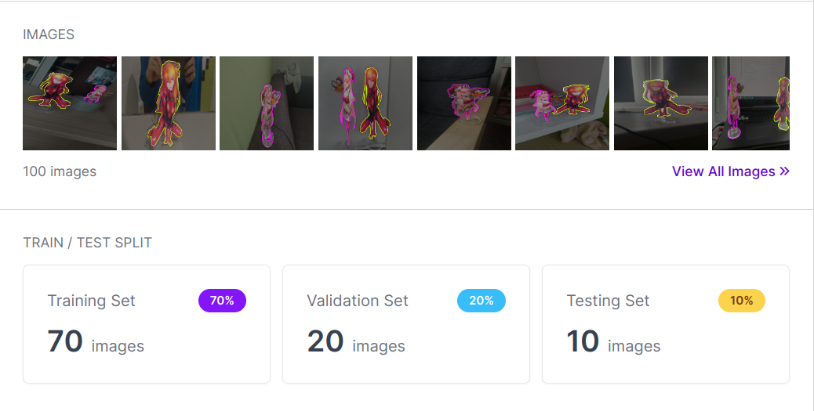
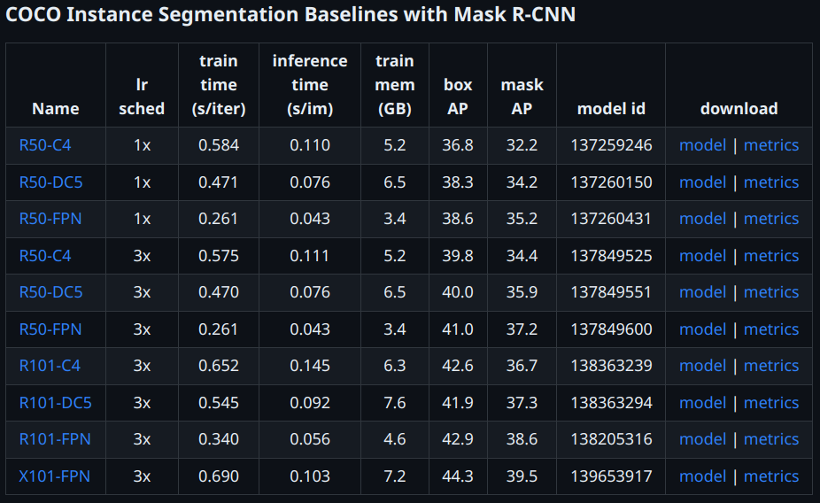
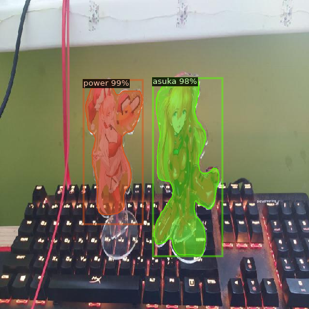
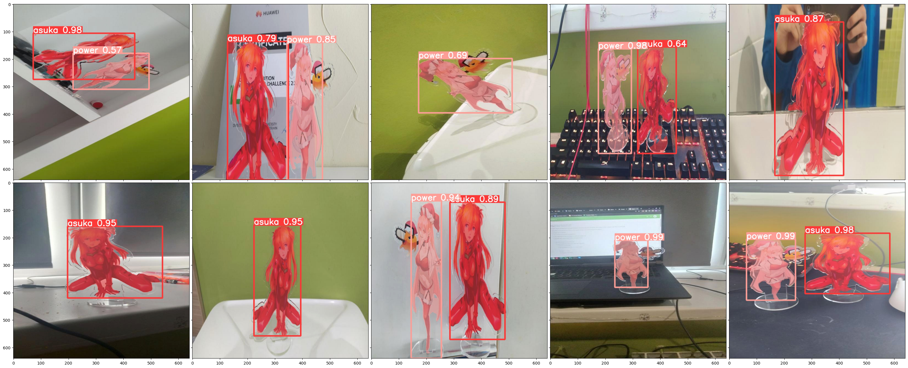

# Assignment I: Faster R-CNN vs YOLOv8
____________________________________
### Robert Chen, B20-AI

### Colab link: [here](https://colab.research.google.com/drive/14gFu9xXMUsY7Q450yABrSiAsNjcNfLFo?usp=sharing)
____________________________________
## 1. Dataset & Objects

I decided to pick my previous dataset as target objects for the task.

They were annotated in the RoboFlow (SmartPolygon tool is very useful) and generated into the dataset with 70%-20%-10% train-validation-test split.

____________________________________
## 2. Training Faster R-CNN using detectron2

*Detectron2* offers a huge variety of different pretrained models:

The best one (on paper) is *R101-FPN* since it has faster training time, good tradeoff between mAP and inference time and is much lighter than other models.

Since *detectron2* is not very intuitive, I used this [blog](https://blog.roboflow.com/how-to-train-detectron2/) and code snippets from this Colab [notebook](https://colab.research.google.com/github/roboflow-ai/notebooks/blob/main/notebooks/train-detectron2-segmentation-on-custom-data.ipynb#scrollTo=7S8y2W2AQvJq)
in order to train and evaluate my model.

The results were very solid:

__________________________________
## 3. Training YOLOv8

*Ultralytics* package does not provide very flexible functionality like *detectron2* does, but on the other hand, it is much easier to use.
All I needed to make it work was the official [documentation](https://docs.ultralytics.com/python/).

As for the results, *YOLOv8* was much better than *Mask R-CNN* in terms of probabilities on the test set.

*YOLOv8* test predictions for the comparison:

__________________________________
## 4. Comparison

More detailed explanation with metrics can be found in the Colab [notebook](https://colab.research.google.com/drive/14gFu9xXMUsY7Q450yABrSiAsNjcNfLFo?usp=sharing).

In short, *YOLOv8* is better in each metric, much faster and a lot more intuitive to use.
